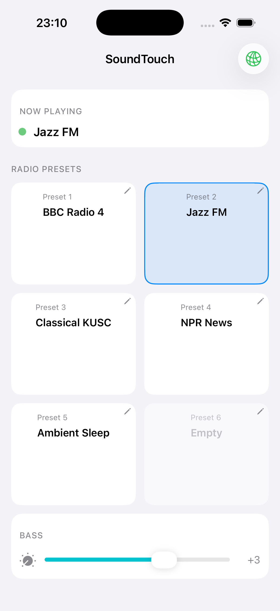

# SoundTouch Device Companion

iOS app for controlling a Bose SoundTouch 20 via the [SoundTouch-Device](https://github.com/jeffevertse/SoundTouch-Device) HTTP API — a Go controller that runs directly on the speaker hardware.



## Features

- **Now Playing** — live track, station, and playback status, polling every 5 seconds
- **Presets** — view and play all 6 presets; tap the pencil to rename or swap the stream URL
- **Bass** — debounced slider from −9 to +9, applied instantly on release
- **Config** — connect to any host/port where SoundTouch-Device is running

## Requirements

- iOS 17+
- [SoundTouch-Device](https://github.com/jeffevertse/SoundTouch-Device) running on the speaker (or any host reachable from the phone)

## Setup

1. Run SoundTouch-Device on your speaker hardware (default port `8099`)
2. Open the app and enter the device IP and port
3. Tap **Connect**

Stream URLs in presets are proxied by SoundTouch-Device, so HTTPS streams work even though the speaker only speaks HTTP.

## Architecture

```
iPhone app  ──HTTP──▶  SoundTouch-Device (Go, armv7)  ──UPnP──▶  Bose SoundTouch 20
            GET /status, /config, /bass
            POST /play/:id, /config, /bass
```

Built with SwiftUI + `@Observable`. No third-party dependencies.
